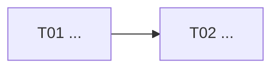

# {{TITLE}}

> Plano em `draft`. Ao terminar de montar as tasks, troque para `ready-for-review` e
> pare (gate de handoff). Veja [[plan-structure]].
>
> **Fluxo (devflow v2):** spec → protótipo ⛔ → behaviors ⛔🧊 → código → review →
> finish. Os ⛔ são gates humanos; o 🧊 é o freeze do contrato: depois dele, cenário
> quebrando significa código errado. Mudar comportamento exige
> `kb dev unfreeze <slug> --reason "..."`.

## Objetivo

(o que se quer alcançar e por quê)

## Não-objetivos

-

## Escopo / repos

-

## DAG / paralelismo

## Tasks

| id | título | repo | dep | escopo (resumo) |
|---|---|---|---|---|
| T01 | ... | {{PROJECT}} | — | ... |

## Gates globais

-

## Como aprovar

Revisar cortes/escopos/DAG. Trocar `status: ready-for-review` → `approved` +
`approved_by`. Depois `kb dev run {{SLUG}}` (ou execução manual task a task).
